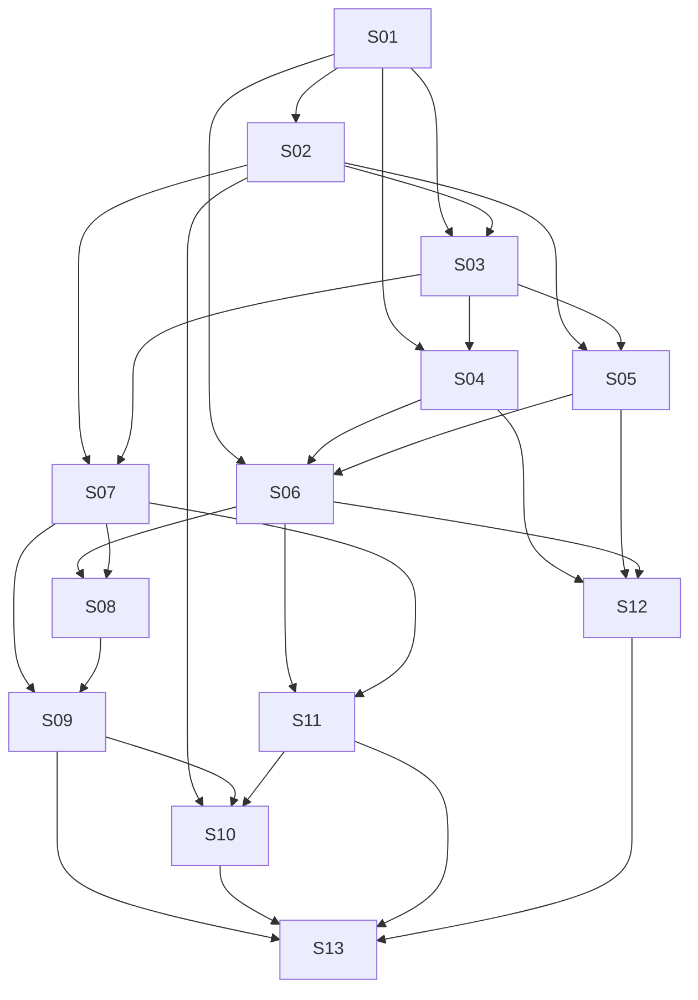

# INOFY v0.1 — Implementation Design Index

Date: 2026-09-28. State: design/planning; no implementation evidence or runnable Go tests. The request to begin detailed design advances planning against the [architecture](../../specs/2026-09-28-inofy-architecture.md); it does not approve publishing a repository or changing either host's product contracts. Source pins and G1–G11 have their authoritative definitions in that architecture. All INOFY code paths in this package are **proposed**. Existing host paths have been checked at the pinned revisions.

## Delivery boundaries

| Epic | Verifiable outcome | Stories | Requirements / gates |
|---|---|---|---|
| E1 Contracts and compiler | Independent consumer validates, compiles and runs bounded structured graphs via pinned Eino | S01–S04 | R1–R6, R12 / G1–G3, G6 |
| E2 Lifecycle | Effects, waits and restart handling have auditable durability | S05–S06 | R6–R7 / G4–G5 |
| E3 Product host | Immutable reusable definitions and authenticated single-process App | S07–S09 | R4, R10, R12 / G9, G11 |
| E4 Editor | One reusable canvas implements the App and host transport contract | S10 | R3, R10–R11 / G1, G10 |
| E5 Real adopters and release | Native ViVy and Garden slices plus release evidence | S11–S13 | R8–R12 / G6–G11 |

## Contracts to hold across Stories

1. Proposed module: `github.com/ProjectViVy/inofy`; separate App module `github.com/ProjectViVy/inofy/apps/inofy` with local `replace` during development. Verify final ownership/remote namespace before a module release; no plan step publishes automatically. Public Go signatures and ownership are those in architecture §6. S01 creates the canonical type declarations; later Stories refer to them rather than creating competing definitions.
2. `Definition` is the sole executable schema; `Artifact` adds presentation. S02 owns strict decoding, normalization, portable JSON Schema and digest fixtures. Browser consumers use server digests.
3. S03 alone owns Eino DAG/branch/select translation; S04 adds repeat to the same compiler; S05 owns per-run wrappers and durable `RunStore` protocol; S06 owns checkpoint/wait/resume. No Story adds a competing scheduler.
4. `RunStore.Commit(ctx, ref, change)` is the one host-controlled atomic visibility boundary. S08 implements its SQLite adapter, S11 maps to ViVy's Journal/blob lifecycle. S12 uses explicit ephemeral RunStore for synchronous read-only recall and Garden's existing durable ingestion receipt for effects; it does not advertise Garden crash-resumable waits. A source-inspected adapter is not accepted until its fault tests pass.
5. UI source of truth: S10 `studio/src/transport.ts`, consuming S09 HTTP and S11 host RPC/event contract; S10 owns both TypeScript transport adapters. S10 builds browser assets; S13 packages them into the Go App. No Node runtime dependency is shipped.

## Story DAG and status

An edge names an **immediate** required accepted output; file conflicts are below. `Planned` means the file-level plan is written and awaiting review/verification; `Blocked` means an implementation-critical proof must run before depending work begins.

| Story | Outcome and owning plan | Immediate predecessor / required output | Status | Evidence or precise blocker |
|---|---|---|---|---|
| S01 | [Public contracts and Eino proofs](S01.md) | — | Done | Green vs eino v0.9.13: root module + contracts, G6 consumer import (1392762), G2 DAG/branch probes (9ea99be), G3/G4 repeat/resume probes (7205956). Findings: resume IDs rotate per emission (Address is stable); unmatched resume keys are silently ignored; non-END-ancestral nodes race settlement. |
| S02 | [Definition validation and digests](S02.md) | S01: accepted types/module | Done | Green: strict decoder + portable schema profile (976d372), inofy-normal-v1 normalizer + named-version digests (5d6aa86), bounded graph admission incl. regions/dominators/activation bound (3f8622b). Fixtures: testdata/definition/{valid,invalid,normal_v1}.json. |
| S03 | [DAG, switch and select compiler](S03.md) | S01: Eino G2 proof; S02: admitted semantic graph | Done | Call/switch/select compile to Eino and execute once via Program.Run; skipped nodes marked from the decision log; `go test ./... -count=10` green. |
| S04 | [Bounded repeat compiler](S04.md) | S03: executable Workflow and branch contract; S01: G3 proof | Done | Repeat compiles to cyclic Graph + Workflow body: state carries via ctl packet (71720d2); per-iteration logical keys, retry-stable keys, cancel propagation (2b19dce). `go test ./... -count=3` + vet green. Rulings: dag mode rejects WithMaxRunSteps → explicit counter is the bound; body "input" = loop state. |
| S05 | [Bounded execution and durable events](S05.md) | S03: compiled nodes; S02: schemas/limits | Planned | Host-boundary fault tests pending. |
| S06 | [Wait, resume and crash classification](S06.md) | S04: repeat paths; S05: committed event/operation boundary; S01: G4 proof | Blocked | G4 proof green in S01 (address-stable resume, staged checkpoint, reopen); awaits S04/S05. |
| S07 | [Draft and publication service](S07.md) | S02: normalized artifacts/digests; S03: catalog verification | Planned | Repository CAS/concurrent publication evidence pending. |
| S08 | [App SQLite authority and dispatcher](S08.md) | S06: recovery contract; S07: version repository | Planned | Pure-Go driver and migrations must be selected/verified. |
| S09 | [App auth, HTTP and catalog](S09.md) | S08: durable App admission; S07: publication API | Planned | HTTP/SSE/security and real provider evidence pending. |
| S10 | [Reusable visual editor](S10.md) | S02: schema/fixtures; S09: App transport; S11: ViVy RPC/event contract | Planned | Browser acceptance G10 pending. |
| S11 | [ViVy adapter and host surface](S11.md) | S06: lifecycle; S07: reusable definitions | Blocked | Prove Journal/checkpoint atomic manifest and native constraints. |
| S12 | [Garden Fast/Deep adapters](S12.md) | S04: repeat; S05: bounded execution; S06: host recovery | Blocked | Extract behavior from live recall services, not dormant pipeline. |
| S13 | [Package and end-to-end acceptance](S13.md) | S09: App; S10: editor; S11: ViVy; S12: Garden | Planned | All G1–G11 required; no passing evidence yet. |

Topological waves from only immediate predecessors: `{S01}`, `{S02}`, `{S03}`, `{S04, S05, S07}`, `{S06}`, `{S08, S11, S12}`, `{S09}`, `{S10}`, `{S13}`. The S01 Eino fixture must actually pass before executing S03/S04/S06; passing a wave boundary alone never grants readiness. S08 and S11/S12 have independent repository ownership after S06. S10's S11 edge is for the concrete host transport, not the host implementation's whole UI lifecycle.

## File ownership and execution notes

| Proposed paths / verified existing paths | Owner | Coordination |
|---|---|---|
| Root `go.mod`, `api.go`, `types.go`, `catalog.go`; `internal/einoruntime/probe_test.go` | S01 | All later INOFY files consume its signatures. |
| `internal/definition/*`, `definition.go`; portable `testdata/definition/*` | S02 | S10 imports generated/checking fixtures; no independent schema copy. |
| `internal/einoruntime/workflow.go`, `branch.go`; `compiler.go` | S03 | S04 extends compiler in separate `repeat.go`, touching shared compile entry only after S03 review. |
| `internal/einoruntime/repeat.go` | S04 | S06 revisits nested checkpoint proof before accepting repeat/wait combination. |
| `internal/execution/{run,events,bounds,store}.go` | S05 | S06 adds `suspend.go` and `recovery.go` and adjusts `run.go` after S05 acceptance. |
| `definitions/{service,repository}.go` | S07 | S08 supplies SQL repository; S11 supplies host-native storage. |
| `apps/inofy/{go.mod,internal/storage/*,internal/dispatch/*}` | S08 | S09 imports from the App module; no root module SQL import. |
| `apps/inofy/{main.go,internal/httpapi/*,internal/auth/*,internal/nodes/*}` | S09 | S13 later owns asset embed/distribution, review shared main.go serially. |
| `studio/src/*` | S10 | S13 builds/embeds output only; generated bundle is reproducibly pinned. |
| `../agent-vivy/internal/runtime/{workflow.go,workflow_service.go,checkpoint*.go}`, `internal/storage/*`, Studio RPC/event bridge | S11 | Read repository AGENTS and existing gates immediately before actual edits. S10 consumes stable transport contract without editing ViVy concurrently. |
| `../laputa/garden/internal/recall/{fast,deep}.go`, `agentapi/*`, tests | S12 | Read scoped AGENTS and ADR-0012 immediately before edits. Preserve API signatures. |
| `apps/inofy/web/*`, distribution scripts and cross-repo acceptance fixtures | S13 | Reviews only; no silent host migrations or external publication. |

## Release traceability

| Gate | Plan evidence |
|---|---|
| G1 | S02, S07, S10 |
| G2 | S01, S03 |
| G3 | S01, S04, S06 |
| G4 | S01, S06, S08 |
| G5 | S05, S06, S08, S11 |
| G6 | S01, S05, S13 |
| G7 | S11, S13 |
| G8 | S12, S13 |
| G9 | S07–S09 |
| G10 | S09–S11, S13 |
| G11 | S08, S09, S13 |

Environment at design time: `node v24.19.0` and `pnpm 11.25.0` available; `go` missing, so every Go command below is an **execution instruction**, not an already-passed check. No credentials or live providers were used. A failed Eino proof, inability to make ViVy checkpoint visibility atomic, or host-authority incompatibility stops the affected successors and returns to architecture review. Changes to public API, scope, or distribution namespace need the owner to review the concrete change. Next executable step is S02, followed by evidence-based status updates in this index.
