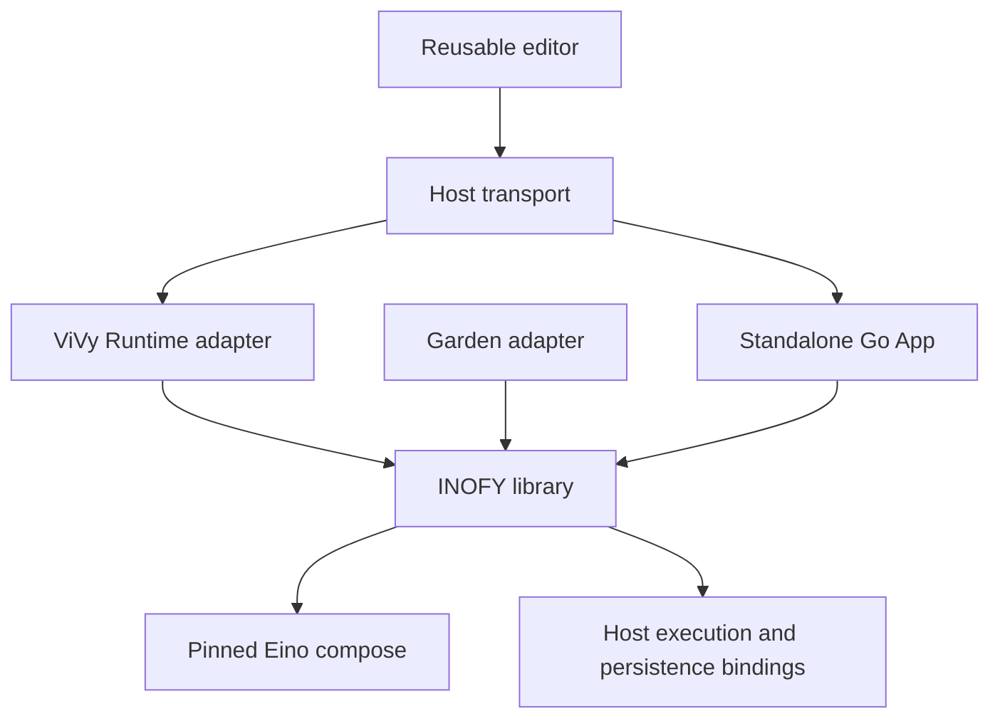
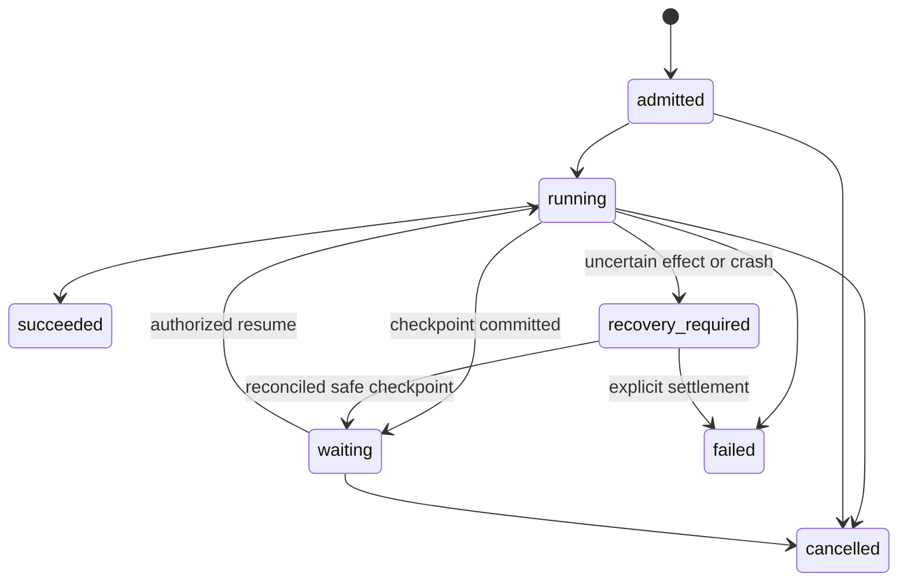

# INOFY — Detailed Architecture

Date: 2026-09-28

Status: Architecture proposal for written-spec review. The product direction is approved; this specification has not yet been approved.

Delivery target: v0.1, including the visual editor.

Evidence level: Source inspection. No INOFY implementation or integration execution is claimed.

## 1. Product contract and decisions

INOFY is an embeddable Go workflow library backed by Eino, with a reusable visual editor and an independently usable application. Its first consumers are agent-vivy and laputa-garden. The owner approved library-first packaging, Eino reuse, a first-release visual editor, and TypeScript for the browser frontend while the engine, execution adapters and server remain Go. The standalone application embeds the built frontend; Node.js is a build dependency, not a deployment dependency.

The smallest adequate solution is a versioned declarative graph compiled to Eino, a small host execution/persistence boundary, and one editor using those same definitions. Hosts supply their existing authority and effects. An INOFY-only scheduler would duplicate Eino; extracting ViVy's current task descriptor unchanged would preserve its text-only limitations; making a standalone service mandatory would add transport and operational costs to both Go consumers. INOFY therefore owns neither a second agent loop nor a shared cross-product authority database.

### 1.1 Requirements and observable acceptance

| ID | Requirement | Acceptance target |
|---|---|---|
| R1 | Library-first Go execution | An independent Go consumer compiles and runs a definition without importing the App, opening a listener, or initializing its database. |
| R2 | Eino-native orchestration | Dependency scheduling, branch activation and loop execution use pinned Eino compose APIs; INOFY does not maintain a competing ready queue. |
| R3 | One definition format | Editor-authored and agent-authored documents have identical backend validation and execution; edit/save/reload preserves graph semantics. |
| R4 | Reusable definitions | Optimistic-concurrency draft updates, immutable publication, and run admission against an exact revision are supported. |
| R5 | Typed dataflow | JSON-schema-validated structured values, explicit bindings, control edges and unambiguous branch joins work for both text tasks and memory records. |
| R6 | Bounded execution | Time, node activations, parallel effects, loop iterations, input/output sizes and retries are bounded and cancellation is propagated. |
| R7 | Honest durability | Cooperative suspension can resume from a compatible checkpoint; ambiguous effects after a crash cannot be silently replayed. |
| R8 | ViVy integration | Existing host authorization, child runs, budget accounting, Journal and generation identity remain authoritative. |
| R9 | Garden integration | Frozen Core, cards/evidence, scoped recall, degradation and ingestion identities retain their existing meanings. |
| R10 | Usable standalone App/editor | A user can configure a supported node, draw and publish a graph, run it, inspect results, and resolve a persisted wait. |
| R11 | Composable UI | The editor can run inside the standalone App or a host UI through a transport interface and capability-driven catalog. |
| R12 | Minimal maintenance | One runtime implementation, one semantic schema, no mandatory external services for the standalone single-process deployment. |

### 1.2 First-release scope

The first release includes a DAG graph, switch/select control structures, a bounded serial repeat body, immutable definition versions, structured node calls, durable run events, cooperative waiting/resume, the editor, and an App host with local SQLite persistence. It includes actual integration slices in both consumers; a mock-only host demo is insufficient for release acceptance.

Bounded repeat is a design choice justified by Garden's declared retrieval/sufficiency back-edge, not a claim that its current live recall uses that configuration. v0.1 supports one repeat nesting level and no external workflow recursion. This keeps graph containers testable without a general recursive workflow language.

Distributed execution, worker services, cron/webhook ownership, arbitrary user code execution, remote plugin installation, full Dify DSL compatibility, and cross-version checkpoint conversion are outside this release. The corresponding extension points are ordinary host calls or future schema revisions; empty framework scaffolding is not required now.

## 2. Source evidence and compatibility baseline

All existing paths below were inspected. All INOFY paths in this document are proposed.

| Source | Inspected revision | Relevant evidence |
|---|---|---|
| agent-vivy | `83d6610545a8831937b2d351176353008881446b` | `internal/runtime/workflow.go`, `workflow_service.go`, `internal/orchestration/descriptor.go`, `internal/domain/workflow.go`, `internal/runtime/checkpoint.go`, `docs/plans/workflow-system/DETAILED-DESIGN.md`, `AGENTS.md` |
| laputa | `384d54d3a5b98dc00e9c87bcd359c8d55c7ab5ad` | `garden/internal/recall/{fast,deep}.go`, `garden/internal/pipeline/{pipeline,config}.go`, `garden/main.go`, `garden/internal/ingest/service.go`, `garden/agentapi/session_ingest.go`, ADR-0012/0016 |
| Eino integration target | `v0.9.13`, commit `c5e6aef927cca02bea934541f8dff2ea711b2ca7` | `compose/workflow.go`, `branch.go`, `graph_run.go`, `checkpoint.go`, `interrupt.go`, `resume.go`, `workflow_test.go`, `checkpoint_test.go` |
| Eino exploration checkout | `ba04fde8641057055c358d7ab5d3015a9ba825e1` | Kept for comparison; not substituted for the target pin. |
| Dify | `5f6bb5e6d38a076ed0f820488fee8bb818824168` | `api/pyproject.toml`, `api/models/workflow.py`, `api/core/workflow/workflow_entry.py`, `api/core/tools/workflow_as_tool/tool.py`, `web/package.json` |

Issue context: [ViVy #21](https://github.com/ProjectViVy/agent-vivy/issues/21), [#9](https://github.com/ProjectViVy/agent-vivy/issues/9), [#4](https://github.com/ProjectViVy/agent-vivy/issues/4). These are mutable discussion records; source pins above ground implementation claims. The owner's new independent-project decision replaces #21's earlier tentative timing recommendation to extract later. It does not itself change shipped ViVy behavior or authorize external tracker updates.

Observed differences that affect the design:

- ViVy already compiles Eino `Workflow` instances and invokes governed child operations through `WorkflowNodeRunner`. The old `PlanExecutor` type is a design excerpt, not the current main implementation interface.
- ViVy's current run-local descriptor uses bounded string outputs and tight DAG limits. It is not yet a reusable definition catalog. Those existing limits must not be widened merely by adopting INOFY.
- Garden's `FastService`/`DeepService` currently execute the real recall behavior. `main.go` constructs a pipeline manager; the inspected server routes expose pipeline definitions/history. Production recall was not observed invoking that manager's `Run`. Legacy pipeline descriptions are not proof of integrated execution.
- Garden's public `agentapi` and shared runtime composition support a library-first integration direction; library availability is not proof that ViVy already integrates it.
- Dify imports `graphon==0.7.0`. Its application/engine separation, draft/publication model and workflow-as-tool boundary are useful precedents. Graphon's internal scheduler was not audited in this work.
- Dify's inspected frontend imports `reactflow`. INOFY proposes the React Flow ecosystem, not a claim that this Dify checkout already uses `@xyflow/react` or that its UI should be copied.

## 3. Ownership and packaging



Arrows represent dependencies/calls, not grants. Host bindings may call their own services; they must not recursively route back through the same workflow without an admitted child operation.

| Owner | Owns | Receives from another owner |
|---|---|---|
| INOFY | Graph format, pure validation, compilation, node lifecycle mapping, immutable program metadata, editor | Trusted catalog, invocation context, effect execution and durable storage |
| ViVy | Identity, Policy/Approval, Service.Run, child Run lifecycle, Journal, model/tool budgets, storage migrations | INOFY graph semantics and execution events |
| Garden | Principal/profile binding, recall semantics, context limits, ingestion receipts, domain traces | INOFY dependency and control-flow execution |
| Laputa/Mentle | Persona authority / canonical material and evidence respectively | Governed calls from Garden, never new authority from INOFY |
| Standalone App | Its principal, credentials, connections, admission, storage, local lifecycle | The same library and editor used by embedded hosts |

Proposed repository shape:

| Path | Responsibility |
|---|---|
| `go.mod`, root package `inofy` | Public data types, catalog, validation, compilation and invocation facade |
| `definitions/` | Optional draft/publication service and repository contract, using core definition types |
| `internal/einoruntime/` | All Eino imports and graph/checkpoint translation |
| `internal/definition/` | Schema, normalization, structural validation and stable digests |
| `internal/execution/` | Per-run wrappers, data binding, event identities and bounds; no graph scheduler |
| `studio/` | TypeScript editor package, transport contract and localization |
| `apps/inofy/go.mod` | Separate App module, isolating SQLite/model-provider dependencies from library consumers |
| `apps/inofy/main.go`, `internal/`, `web/` | Go host composition, HTTP/storage/provider adapters and embedded built assets |
| `examples/` | Small independent embedding examples, not production configuration sources |
| `docs/superpowers/specs/` | This authoritative architecture specification |

Use two Go modules because the App requires SQLite and model-provider adapters while the embeddable engine must not pull them into every consumer. Do not create additional modules per node. The final publication namespace is an administrative choice at repository creation; no remote INOFY repository or module publication is claimed here.

Dependencies point from the App and optional definition service to the core. The core never imports `apps`, HTTP handlers, a SQL driver, frontend assets, ViVy, or Garden. Host integration adapters belong to their respective host repositories. The editor's transport has no dependency on ViVy RPC names.

## 4. Definition, values and identity

### 4.1 One semantic document

`Definition` contains `schema_version: "inofy.workflow/v1"`, `inputs_schema`, `outputs_schema`, `graph`, and `limits`. A `Graph` contains nodes, edges, output bindings, and exit node IDs. A `Node` is a tagged union of `call`, `switch`, `select`, and `repeat`; fields belonging to another kind are rejected. Each node has a stable ID unique within its graph. Reserved generated IDs begin with `$`; authored IDs cannot use this prefix or `/`.

The artifact envelope has exactly `definition` and `presentation`; `presentation` contains title, description and `layout`. Layout holds node positions keyed by ID, viewport, and collapsed containers. Titles, descriptions and layout are not executable inputs. Unknown executable fields are errors; unknown presentation fields may be preserved within the presentation namespace. Node configuration cannot hide executable code inside presentation metadata.

Normative executable field vocabulary:

| Object | Fields |
|---|---|
| Graph | `nodes`, `edges`, `exits`, `outputs` |
| Edge | `from`, `to`, and `port` only when `from` is a switch |
| Call | `id`, `kind: call`, `type`, `config`, `inputs`, optional `timeout_ms`, `retry`, `on_error` |
| Switch | `id`, `kind: switch`, `inputs`, ordered `cases: [{port, when}]`, `default_port`, `join` |
| Select | `id`, `kind: select`, owning `switch`, `candidates: [{source, pointer}]`, optional `fallback` binding |
| Repeat | `id`, `kind: repeat`, `initial`, `state_schema`, `body`, `max_iterations`, `until`, optional `on_error` |
| Retry | `max_attempts`, `delay_ms`; retryability additionally requires the trusted executor's error classification |
| Error policy | `{mode: fail}` or `{mode: fallback, value: <JSON>}` |
| Predicate | Tagged `op`; comparisons use `left`/`right` bindings against switch input or repeat body output, `exists` uses one pointer, `all`/`any` use `args`, `not` uses `arg` |

A switch's `join` names its select in the same graph; each port region produces exactly one candidate for that select. Parallel work within one port must first aggregate into that candidate. Distinct port regions are disjoint before the select, every path in each region reaches that select, and regions are properly nested when switches nest. The compiler checks this with bounded reachability/dominator analysis over the admitted DAG; cross-region edges and outside entries are rejected, except data from ancestors that dominate the switch. Such ancestor data is supplied without a new activation route. This restriction makes conditional optionality decidable without arbitrary logical predicates or a runtime skip scheduler.

Public values are JSON-compatible, with immutable ownership at node boundaries. Objects, arrays, strings, booleans, null and finite numbers are supported. Integers must remain within JavaScript's exact integer range; larger identifiers/integers use strings. Absent and explicit null are different. A `json.RawMessage` is validated and defensively copied before storage or transfer of ownership. No function, database handle, host credential or live Go object can enter a definition/checkpoint value.

Node descriptors carry JSON Schema 2020-12 configuration/input/output schemas. Reuse `santhosh-tekuri/jsonschema/v6` (both hosts already reference v6.0.2) rather than invent schema validation. Schema resolution permits local document references only; remote schema loading is disabled. v0.1's portable UI/schema profile supports object properties/required/additionalProperties, primitive types, arrays/items, enum and simple numeric/string bounds. Definitions requiring unsupported schema constructs are rejected explicitly. The UI can always fall back to a JSON editor for a supported schema it cannot render as a specialized form.

### 4.2 Bindings

A binding is exactly one of a JSON literal or a source reference. A source reference names `input` or a node ID and a JSON Pointer. Node input bindings target top-level properties of the node's input object; nested data is passed as a whole value. Configuration is static validated JSON, never a template used to fetch hidden inputs. A dedicated pure template node handles explicit string interpolation.

Every reference to a node output must have a direct graph edge from that node to the consumer. Output bindings refer to declared graph exits. There is no implicit access to all previous results, host globals, environment variables or sibling iterations. Root input references are allowed on any node but do not grant execution eligibility.

Illustrative binding:

```json
{
  "query": {"source": "input", "pointer": "/query"},
  "cards": {"source": "search", "pointer": "/cards"},
  "limit": {"literal": 12}
}
```

The semantic schema is authoritative. Go decoding, API validation and editor-generated types must derive from or be checked against the same schema fixture; manual divergent schema copies are prohibited. Validation returns `{check, path, code, message}` where `check` is `schema`, `topology`, `capability`, `budget`, or `authority`. Only hosts can complete the authority check.

### 4.3 Hashes and publication identity

Use a named normalization algorithm `inofy-normal-v1`: reject duplicate JSON object keys and invalid numbers; decode accepted numbers to finite binary64, reject integral values outside the safe integer range, and normalize negative zero to zero. Re-encode the normalized JSON value with Go `encoding/json`, HTML escaping disabled, no indentation and no trailing newline. Object keys use that encoder's sorted order; node arrays are sorted by ID and edges by `(from, port, to)`. Preserve ordered switch cases and other order-sensitive arrays. Strings retain their Unicode code points without Unicode normalization. This is INOFY's named encoding, not a claim of RFC 8785 compliance. The implementation must include Go/browser round-trip fixtures for numeric precision, escaping, Unicode and empty/null distinctions. Browsers use the server-returned digest rather than an independent hash implementation.

`DefinitionDigest` is SHA-256 over normalized semantic definition bytes. `ArtifactDigest` additionally covers its presentation metadata. Layout edits leave `DefinitionDigest` unchanged. `CatalogDigest` covers only used node descriptors and trusted implementation identities, not unrelated installed nodes. `ProgramDigest` binds DefinitionDigest, CatalogDigest, INOFY compiler/format version and the exact Eino build identity. The run additionally records input digest, host binding identity, and admission limits.

`schema_version` is the file-format version; `revision` is the immutable published workflow revision; node type major versions govern node contracts. These are distinct. A published revision never silently resolves to a different node implementation: changed implementation identity requires republishing or an explicit reviewed compatibility decision. `latest` is resolved once at admission and stored as the resulting exact revision.

### 4.4 Draft/publication service

The optional `definitions.Service` provides `SaveDraft(expectedETag)`, `ValidateDraft`, `Publish(expectedETag, catalog)`, `GetRevision` and bounded listing. Its repository adapter must atomically implement CAS draft updates and publication. One mutable draft exists per workflow ID; publication allocates an increasing integer revision and freezes the artifact, semantic digest and used catalog identity. Repeated publication of the same artifact is idempotent and returns the existing revision. Concurrent editors receive a conflict, not a last-writer overwrite.

The library may run an explicitly supplied definition without this service. ViVy/Garden may keep their own product definition storage while using INOFY validation; migration must identify exactly one authority for each definition. Archiving prevents new admissions; it does not remove revisions referenced by runs or checkpoints.

## 5. Graph and node semantics

### 5.1 DAG execution

The outer graph and each repeat body are DAGs. Every node must be reachable from an implicit root and reach a declared exit. An order-only edge waits without transferring a value; bindings transfer explicit values. Multiple ordinary predecessors form an AND dependency. Independent ready nodes may execute concurrently within the effective host limit. Completion order among independent nodes is unspecified.

Graph success requires all active exits to complete, all required output bindings to resolve, output schema validation, and durable terminal commit. The compiler attaches every declared exit to Eino END so side-effect-only exit nodes are not abandoned when an output becomes available. Nodes that cannot reach an exit are invalid. No result is exposed as successful before these conditions hold.

### 5.2 Call nodes and the catalog

A call node names an exact type such as `vivy.agent@1`, `garden.search@1` or `inofy.template@1`. A host-supplied `NodeDescriptor` includes configuration/input/output schemas, a trusted implementation ID, display metadata, required capabilities, replay classification and whether suspension is supported. Registration is frozen before compilation. Definitions refer to installed implementations; registration is not a runtime code-loading mechanism.

The App initially supplies pure template/value mapping, a Go/Eino-backed model call with an explicitly configured connection, and a human-input wait node. ViVy supplies its governed agent/model/tool nodes. Garden supplies its domain nodes. Names describe data contracts; effect authority still comes from the host. Provider secrets are resolved by the host from opaque binding IDs outside definition bytes.

### 5.3 Switch and select

A switch receives an explicit input object and evaluates ordered cases, choosing the first matching port or the required default port. v0.1 predicates support `eq`, `ne`, `lt`, `lte`, `gt`, `gte`, `exists`, `all`, `any` and `not` over input pointers and JSON literals. No implicit type coercion; incompatible comparisons fail validation or execution. Predicate depth is bounded. A port may target multiple nodes within its disjoint region; at least one target is required for every port. All authored outgoing edges of a switch are port-labelled. Even a workflow with conditional final results converges through its select before exposing an exit.

A select is the explicit branch convergence node. It receives present predecessor packets, selects the one active branch candidate, and errors if zero or multiple candidates are present unless a declared fallback handles zero. It does not select whichever concurrent result arrives first. Parallel all-results fan-in is an ordinary call node with named required inputs, not select.

Branch-created optionality must be explicit. Required bindings whose source may be inactive need an upstream select or a binding with an explicit schema-valid default. The backend validates these relationships, and runtime missing-binding checks remain authoritative. v0.1 permits only compiler-verified structured single-entry branch regions with explicit convergence/exits; ambiguous crossing branch topologies are rejected with the offending edges. General proof of arbitrary conditional graph satisfiability is not a first-release feature.

### 5.4 Bounded repeat

A repeat contains one inline DAG body, `initial` bindings, a state input/output schema, `max_iterations`, and an `until` predicate evaluated against the body's completed output. It executes at least once. Each successful iteration's validated output becomes the next iteration's input. `until=true` returns that output. Reaching the limit without satisfaction produces `iteration_limit`; a declared fallback must explicitly handle it. No hidden unlimited loop or silent success on exhaustion.

The repeat body cannot reference nodes outside its graph directly; values enter through `initial`. Loop-carried data is explicit and bounded. Logical node keys include the container path and zero-based iteration, e.g. `search_more/2/retrieve`. Retry attempts do not change that logical key. One repeat nesting level is supported in v0.1; external recursive workflow invocation is rejected.

This is implemented as a small Eino cyclic Graph containing an Eino Workflow body, condition routing and checkpointable loop state. It is not implemented as an INOFY task scheduler. The concrete interaction of nested branches, loops and suspension is a required conformance gate in section 15.

### 5.5 Failure, fallback and retry

The default is `fail`. `fallback` supplies an output that must satisfy the node's output schema, records the original error and a degradation warning, and permits downstream use. Generic `skip and pretend success` is excluded; a skipped branch has no value, while a fallback has a real typed value. This maps Garden's optional sources into explicit domain-compatible degraded outputs.

Retries are bounded attempts on a call node, use a host-classified retryable error and context-aware delay, and require the trusted replay policy to allow them. Validation/authorization errors, unsupported nodes, input mismatch and unknown effects are never automatically retried. Pure nodes may retry; idempotent effects must reuse their original operation key and ledger; non-replayable effects require host resolution. Retry count means total execution attempts, including the first. Suspension/resumption is continuation of an attempt and does not spend an additional retry attempt.

Fallback may handle known operational failures, not failed durable event commit, unresolved effect outcome, authorization denial or checkpoint integrity failure. Those stop progression regardless of definition-supplied policy.

## 6. Public Go boundary

The following signatures define the proposed ownership boundary; they are specification excerpts, not implemented code. Public structs use Go/JSON values and standard-library context/errors. No Eino type crosses this API.

```go
func Compile(ctx context.Context, def Definition, catalog Catalog,
    options CompileOptions) (*Program, []Diagnostic, error)

func (p *Program) Run(ctx context.Context, request RunRequest,
    bindings Bindings) (RunResult, error)

type Bindings struct {
    Nodes NodeExecutor
    Runs  RunStore
}

type NodeExecutor interface {
    Execute(ctx context.Context, call NodeCall) (NodeReply, error)
}

type RunStore interface {
    Commit(ctx context.Context, ref ExecutionRef, change RunCommit) (Receipt, error)
    Load(ctx context.Context, runID string) (RecoveryState, error)
}
```

`Program` is immutable and safe for concurrent invocation with different run IDs. A catalog is an immutable snapshot of descriptors. Neither object holds run state, live credentials, host globals or current-run closures. Eino lambdas obtain the run-scoped environment from the invocation context; host data is bound by trusted code, not decoded from model-authored metadata.

| Type | Required contents and meaning |
|---|---|
| `CompileOptions` | Host-supported features and maximum admissible graph limits; no authority grant |
| `ExecutionRef` | Host-assigned RunID, exclusive writer Epoch, ProgramDigest and opaque HostBindingID |
| `RunRequest` | ExecutionRef, input JSON, effective Limits, and optional ResumeRequest; admission identity must match stored state |
| `NodeCall` | ExecutionRef, logical node path, TypeID, ImplementationID, config, input, stable OperationKey, attempt number and optional continuation data |
| `NodeReply` | Exactly one of completed output or WaitRequest; completed output must satisfy the descriptor schema |
| `WaitRequest` | Host-generated request ID, kind, redacted prompt, answer schema and opaque continuation reference |
| `RunCommit` | Stable CommitID, semantic events, optional protected result updates, optional checkpoint envelope, and expected run-state transition |
| `Receipt` | Durable sequence range and committed projection revision; assigned by the host |
| `RecoveryState` | Admitted identities/input digest/limits, current status, durable usage, latest committed checkpoint and unresolved operation references |
| `RunResult` | Succeeded/waiting/failed/cancelled/recovery_required, bounded outputs, warnings and terminal diagnostics |

`Compile` performs structural validation and compilation without I/O effects. The host then authorizes the normalized definition against the caller and freezes admission. `Run` rejects mismatched program identity or wider limits. Credential resolution and current revocation checks happen again inside `NodeExecutor.Execute` before each effect.

`RunStore` is a transactional adapter to the host's authoritative execution evidence. It is not a mandatory INOFY database. `Commit` atomically accepts events, protected results, projection updates and an optional checkpoint for one run. Repeating the same CommitID and semantic body returns the original receipt; changing the body produces `idempotency_conflict`. Stale writer epochs fail before writes. Storage errors are returned and never converted into successful progress. All critical commits use a short host-bounded persistence context that can outlive the cancelled execution context; cancellation must not prevent recording the resulting known outcome. This context cannot be used to continue effects.

The in-memory adapter implements the same contract for tests and explicit ephemeral embedding. It advertises that process-restart recovery is unavailable. The standalone App uses durable storage by default. Calling library initialization must not create goroutines, files, databases, network clients or listeners; those are explicit host lifecycle actions.

## 7. Eino translation and runtime mechanics

### 7.1 Capability mapping

| INOFY responsibility | Inspected Eino v0.9.13 API | Adaptation |
|---|---|---|
| DAG dependencies | `compose.NewWorkflow`, `AddLambdaNode`, `AddDependency` | One graph scope becomes one Workflow; call lambdas wrap host execution. |
| Input mapping | `AddInput`, `compose.MapFields`, `ToField` | Map whole predecessor packets to node IDs, then resolve validated JSON Pointers in the wrapper. |
| Non-triggering data | `AddInputWithOptions`, `WithNoDirectDependency` | Root/ancestor data may be supplied only where a separately validated control path governs activation. |
| Conditional activation | `Workflow.AddBranch`, `NewGraphMultiBranch` | Switch outputs choose a declared port's complete set of targets. |
| Repeat | `compose.NewGraph`, `AddGraphNode`, `AddBranch`, `WithMaxRunSteps` | Cyclic container with an acyclic body and explicit loop-carried state. |
| Nested execution | `Workflow.AddGraphNode` | Embed repeat containers without losing Eino's addressed interrupt propagation. |
| Waiting | `StatefulInterrupt`, `ExtractInterruptInfo` | Translate host WaitRequest and continuation references to Eino interrupts. |
| Continuation | `GetResumeContext`, `BatchResumeWithData`, `WithCheckPointID` | Resume only committed, explicitly answered waits. |
| Checkpoint payload | `WithCheckPointStore`, `schema.RegisterName` | Private packet/state types are serializable; adapter stages opaque payload before host atomic suspension commit. |
| Observation | Eino callbacks where useful | Debugging only; required durable event writes happen in error-returning wrappers. |

These API observations are not execution proof. Section 15 lists the combinations that must run against the exact target version before implementation depends on their behavior. If a combination fails, use a supported Eino adaptation or explicitly revise the feature contract; do not hide a replacement scheduler underneath the adapter.

### 7.2 Compilation algorithm

1. Decode strictly, normalize the semantic document, validate its portable schemas and graph limits.
2. Resolve every call type against the frozen catalog. Validate config, bindings, required capabilities and replay/fallback policies.
3. Check unique IDs, roots/exits, acyclicity per scope, structured branch regions, data dependencies and bounded repeat nesting. Precompute each scope's maximum structural activation count.
4. Create an Eino Workflow per DAG scope. Each node receives a map from predecessor ID to an immutable packet. Extract whole packets rather than mapping a possibly absent deep field directly inside Eino.
5. Add dependency edges and explicit data mappings. Root input mappings to gated nodes use non-triggering mappings; they must not create an alternate activation route. Eino remains the authority for readiness and inactive-branch propagation.
6. Add switch branches. Add an explicit select wrapper for conditional convergence. A missing packet is permitted only for a validated inactive alternative/default; it is never silently converted into JSON null.
7. Compile a repeat container as an Eino Graph holding a serialized iteration counter and state; embed its body Workflow as a graph node. Check the explicit iteration count in addition to the engine's defensive max-step bound.
8. Attach graph exits and validate/map final outputs. Freeze the program metadata and effective compile limits.

The compiler may add internal passthrough/join/control nodes. They receive deterministic reserved IDs, map back to authored paths in diagnostics, and do not appear as user-editable business nodes. Structural normalization is permitted; a second runtime scheduler is not.

### 7.3 Per-call execution sequence

1. Check run cancellation, admission identity, applicable graph bounds and available invocation budget.
2. Resolve input bindings; validate input schema and size. Acquire a run-shared, context-aware effect permit before a leaf call.
3. Commit the node-start/attempt record. If the commit fails, do not call the host executor.
4. Invoke `NodeExecutor.Execute` under the effective deadline. The host rechecks authority, reserves model/tool costs and consults its effect ledger as applicable.
5. A completed reply is validated, bounded and durably committed with its output reference before being returned into the Eino graph. A known error follows the allowed retry/fallback policy. A wait reply becomes an Eino interrupt.
6. Release the permit in all paths. Containers do not hold effect permits while waiting on their child graphs; this prevents nested permit deadlock.

Independent siblings may already be running when another node fails. The run cancellation signal stops new effects, asks siblings to stop, and waits for their outcomes. A successful write by a sibling is not rolled back implicitly. Uncertain sibling outcomes dominate the run result as `recovery_required`.

### 7.4 Resource model

Effective limits are the minimum of definition requests and trusted host ceilings. A missing definition limit inherits the host default. Limits are part of admission and persisted across waits; resume cannot reset spent budgets. Eino max-run-steps is not used as a substitute for node, effect or token accounting.

Proposed standalone defaults are safety/configuration choices, not measured performance results:

| Limit | Default |
|---|---:|
| Authored nodes, recursively counted | 64 |
| Edges, recursively counted | 128 |
| Parallel leaf calls per run | 4 |
| Repeat nesting / maximum iterations | 1 / 8 |
| Total call activations including retry attempts | 256 |
| Attempts per call | 1, opt-in up to 3 |
| Node timeout / total active-run time | 60 seconds / 10 minutes |
| Semantic definition / node input / node output | 1 MiB each |
| Cumulative completed outputs retained by one run | 16 MiB |
| Checkpoint payload | 16 MiB |
| Predicate nesting | 8 |
| Concurrent App runs / durable pending admissions | 4 / 32 |

Published definitions exceeding host ceilings are rejected rather than truncated. ViVy retains its current descriptor/authority bounds through its adapter; the larger App defaults do not authorize a change there. Garden retains its own cards/evidence/ContextView budgets. Model tokens, tool calls and monetary usage are additionally reserved by the host, not guessed by INOFY.

The active-run clock excludes persisted waiting time, includes retry backoff and node execution, and resumes with its previously consumed duration. Per-attempt node time similarly retains already consumed active time across a wait; the clock starts when its effect permit is acquired. A host may separately expire an outstanding wait. Leaf executions must honor context cancellation. The engine does not spawn abandoned goroutines to pretend an uncooperative Go function stopped; such a function delays run settlement and remains a host defect to report. Hard termination requires process isolation, which is outside this release.

## 8. Lifecycle, events and recovery

### 8.1 Run and node states



Run `waiting` is a durable, quiescent suspension, not a goroutine blocked on human input. `cancel_requested` is a flag while execution settles; it does not itself imply terminal cancellation. Admission/launch failures produce a visible failed admission or cancelled run according to whether a run record was already created. A terminal run is never resurrected by retrying its creation request.

Node states are `not_started`, `running`, `waiting`, `completed`, `degraded`, `failed`, `cancelled`, `skipped` and `unknown`. Attempts are children of a logical node execution; iteration is part of the logical node path. On successful graph settlement, never-entered inactive nodes can be marked skipped. On failure/cancellation, remaining nodes stay not_started unless actual cancellation or branch exclusion is established. The UI must not fabricate skip callbacks that Eino never emitted.

### 8.2 Events and identities

Semantic events cover run admission/start/wait/resume/terminal state and node attempt/start/completion/degradation/wait/failure. Switch decisions and repeat iteration boundaries are also recorded. Eino compiler-generated control nodes remain implementation detail. The host assigns ordered run sequence numbers and committed timestamps.

Use stable CommitIDs based on RunID, continuation generation, logical node path, attempt and transition ordinal. Ordinals and continuation generation are included in committed recovery metadata. Transport redelivery reuses the original ID/body. Event payload identity excludes storage-assigned sequence/timestamp. OperationKey for a node effect is derived from the host RunID and logical node path; retries and resumes retain it, while a different repeat iteration gets a different key. A root invocation idempotency key is scoped by trusted principal/workflow, not globally by untrusted user text.

Protected outputs and checkpoint bytes are stored separately from the redacted event projection. UI/SSE events carry bounded summaries and references; fetching a full node output rechecks access. Tokens and secret material cannot appear in events, definitions or checkpoint state. Privacy-sensitive memory content can be retained only under the host's existing access and retention rules.

### 8.3 Cooperative suspension protocol

1. The executor returns WaitRequest before an unresolved protected effect, or a safe resumable continuation reference owned by the host. Prompt/answer schema must be durable metadata, not only Eino's transient interrupt information.
2. The Eino adapter creates a stateful interrupt containing only the serializable continuation reference. A per-run suspension flag closes the leaf effect gate: newly entered wrappers return an internal Eino interruption before starting an effect. Other active nodes finish or reach safe waits. Internal gate interrupts are recorded as engine continuations and automatically resumed with the authorized human waits; they never become additional human prompts. G4 must verify this barrier against the pinned runner.
3. `CheckPointStore.Set` writes to a per-invocation staging buffer. It does not independently mark the run waiting.
4. After Eino returns a resumable interruption and is quiescent, one `RunStore.Commit` persists the opaque checkpoint envelope, outstanding waits, usage, node projections and `run.waiting` atomically. If this fails, the run is not reported as durably suspended.
5. No effect is allowed after this commit until the host admits a resume. If the process dies before commit, the stored running status requires reconciliation rather than an invented checkpoint.

The envelope binds RunID, continuation generation, DefinitionDigest, ProgramDigest, exact Eino build identity, serializer version, host binding/generation identity, input digest, usage, checkpoint checksum and the durable event boundary. The Eino payload is opaque. INOFY must not promise to reconstruct it from UI events or port it between Eino releases.

### 8.4 Resume protocol

The host acquires the exclusive run writer, loads the waiting snapshot, verifies all identities, rechecks current permission/revocation, validates answers against every outstanding wait, and commits the resume claim. v0.1 resumes all outstanding waits together; partially supplied answers do not start execution. Exact-repeat resume requests return their existing result; conflicting answers for an already claimed continuation fail CAS.

The library injects the approved values through Eino's addressed resume data, loads the exact committed checkpoint and continues under the remaining budget. It does not reopen a draft, resolve a fresh model profile, replace a frozen persona/context, or enlarge the initial grant. Credential rotation may resolve the same approved binding to a new secret; changing provider/model/authority identity requires a new admitted run.

Two concurrent resume attempts must not both execute a node. The host's admission/CAS and writer epoch enforce this; a process-local mutex alone is insufficient to justify restart recovery.

### 8.5 Crash and unknown effects

A durable checkpoint is a safe suspension snapshot, not proof of exactly-once effects. After a crash, any admitted run marked running becomes recovery_required unless the host proves it had not begun. Never automatically replay its graph solely because an older checkpoint exists.

Reconciliation examines all started operations after the saved boundary against the host's effect ledger. A recorded success must reuse its recorded output; an idempotent operation can be retried only under its original key; a non-replayable ambiguous effect remains unknown. Only when every relevant operation is resolved and a compatible safe checkpoint is available may recovery return to waiting. Without that checkpoint, settle the old run explicitly and admit a new run after checking the effect consequences. v0.1 provides fail-safe classification and host-assisted reconciliation, not a generic recovery solver for arbitrary effects.

| Failure point | Required result |
|---|---|
| Start-record commit fails | No effect is invoked. |
| Effect returns known failure | Apply authorized retry/fallback or fail; record the cause. |
| Effect succeeds, output/event commit fails | Stop downstream progression; recovery_required. |
| Checkpoint is staged, process dies before atomic suspension | Stored run remains running; reconcile. |
| Checkpoint committed, process restarts | Waiting state may resume after identity/permission checks. |
| Timeout after remote effect may have happened | Unknown outcome; never blindly retry. |
| Checkpoint version, digest or authority identity differs | Refuse resume with an explicit incompatibility error. |
| SSE subscriber disconnects | The run continues; subscriber reconnects from committed sequence. |

### 8.6 Error contract

Errors have stable code, category, authored node path if applicable, safe message and wrapped internal cause. Codes include `invalid_definition`, `unknown_node_type`, `unsupported_feature`, `binding_missing`, `schema_mismatch`, `authority_denied`, `budget_exceeded`, `deadline_exceeded`, `iteration_limit`, `node_failed`, `storage_failed`, `outcome_unknown`, `checkpoint_incompatible`, `revision_conflict`, `idempotency_conflict` and `stale_writer`. A host adapter maps these into its native error taxonomy without turning them into successful empty outputs.

## 9. ViVy integration architecture

INOFY's executable dependency is introduced inside `internal/runtime`, keeping ViVy's Eino quarantine and domain authority intact. Other ViVy layers use their existing domain/RPC contracts. The public INOFY schema can be exposed as data, but product/storage packages must not start executing programs or importing private Eino machinery.

| Existing responsibility | Adaptation |
|---|---|
| `orchestration.Descriptor` and `Validate` | Convert the existing run-local task DAG to an INOFY definition in the Runtime adapter, preserving all current limits and tool narrowing. This is boundary translation, not a new public descriptor version. |
| `executeWorkflowGraph` | Replace graph assembly with INOFY compilation/execution after equivalent behavior passes conformance. |
| `WorkflowNodeRunner` and governed child runs | Become the host implementation of the appropriate INOFY call types. |
| `StartWorkflow` / operation-key admission | Continue to create/bind immutable run revisions and enforce parent/session identities; do not delegate admission to the standalone App. |
| Journal `workflow.*` events | Map INOFY semantic commits to native events and bounded projections with stable identity. |
| Versioned checkpoint storage | Preserve engine/generation/prompt identity checks around opaque Eino bytes; add INOFY program identity without duplicating checkpoint authority. |
| Reusable workflow product | Add the definition catalog/version service under the existing product design after reconciling its old seam with current code. |
| Workflow UI module | Embed `studio` using a ViVy transport adapter and existing UI/module lifecycle. |

ViVy storage adapters own any migrations, including SQLite/PostgreSQL parity and repository gates. INOFY cannot run DDL against ViVy's core store. For hosts whose blob store and Journal are separate, `RunStore.Commit` provides logical atomic visibility: persist an immutable checkpoint blob first, then atomically commit the authoritative Journal/manifest reference and projection. Unreferenced blobs are recoverable garbage; a reference must never become visible before its verified bytes. The existing host storage capabilities must be checked before claiming this adapter is ready.

Old run-local descriptors keep their admission/recovery semantics. Reusable INOFY definition storage is a separate product capability and must not make core delegation depend on the editor or standalone App. Published definitions remain data; adding a new executable ViVy node still follows Module/Recipe/Generation rules. A new public workflow-node Port is not assumed supported; it requires the existing catalog/conformance process if and when third-party providers need it.

The integration fixture is a read-only bounded parallel task graph with aggregation. Required checks include parent authority narrowing, exact parent/session/run identity, output bounds, cancellation, repeated operation keys, unknown outcomes, Journal persistence failures and unchanged normal delegation when the reusable workflow product is absent. Approval-resume tests use existing governed paths, not a library-local approval flag.

## 10. Garden integration architecture

Garden retains its public `agentapi` and HTTP domain contracts. Its INOFY adapter binds a trusted principal/profile/session, not principal fields from definition JSON. Domain operations remain in Garden/Laputa/Mentle; node handlers call those operations through narrow functions. The library neither stores Persona documents nor becomes a memory backend.

Initial node contracts should be extracted from the actual recall services at the inspected pin:

| Node family | Input/output | Preserved behavior |
|---|---|---|
| Frozen context | Bound session -> bounded FrozenCore | Six permitted frozen projections; no automatic WORLD/ACTMEM injection |
| Card search | Query, scope, limit -> cards, warnings | Card discovery before bounded evidence reads |
| Filter/rank/deduplicate | Cards and scoped policy -> bounded cards | Existing filtering/ranking behavior before any proposed algorithm change |
| Evidence read | Selected card IDs and budgets -> fragments | Explicit evidence limits and provenance |
| Optional planning/expansion | Intent/entities -> query/entity candidates, warnings | Deterministic or visibly degraded behavior without an LLM/source |
| Context assembly | FrozenCore, evidence, budget -> ContextView | Disposable output, never Persona or canonical-memory authority |
| Ingestion invocation | Trusted durable event identity -> receipt/status | Existing accepted-vs-completed distinction and conflict behavior |

The first real integration replaces orchestration for Fast Recall while keeping its externally observable contract. Deep Recall then adds the optional planner, KG/timeline branches, warning collection and existing bounds. Its configured retrieval/sufficiency recurrence is represented by repeat only when that explicit pipeline is enabled; the shipped one-pass API must not silently become a multi-pass expensive operation.

Ingestion remains owned by Garden's existing durable service. An INOFY ingestion call submits with the original event identity and returns its durable receipt. It does not add a second ingestion worker queue or duplicate canonical writes. Completion can be exposed as a later explicit status call; it must not block automatic fast context preparation on unbounded extraction.

Legacy classification for the host migration:

| Classification | Treatment |
|---|---|
| Keep | Scoped recall, Frozen Core rules, cards/evidence boundaries, ContextView budgets, warnings, trace visibility and ingestion idempotency |
| Cut after replacement acceptance | Redundant pipeline scheduling code and duplicate definition authority for migrated flows |
| Deferred | Conversion of unrelated Garden background/evolution processes; cross-domain workflow catalog synchronization |
| Drop | Assumptions that an existing YAML back-edge is already the live Recall path; copying legacy mutable shared State into parallel nodes |

Golden fixtures compare domain outputs, warnings and budget consumption; nondeterministic trace IDs/timestamps are normalized for comparison. Evidence on migration includes negative WORLD/ACTMEM tests, profile/session isolation, frozen revision preservation, failure degradation and duplicate ingestion receipts. Passing engine unit tests alone cannot establish Garden compatibility.

## 11. Standalone application

### 11.1 Composition and lifecycle

`inofy serve` opens explicitly configured state and connection paths, obtains exclusive ownership of its state directory, initializes the App's migrations, builds a frozen catalog, loads definition metadata and starts a Go HTTP server serving the embedded editor. Default binding is loopback. `inofy validate`, `inofy run` and `inofy inspect` use the same validation/execution packages; a CLI opening the state directory must respect the same single-process ownership lock. Offline validation does not require that directory.

The App is a single process with bounded concurrent runs. Admission persists the immutable source snapshot, input digest, trusted binding and root idempotency key before execution. A bounded in-memory dispatch channel is a wake-up mechanism for persisted admitted runs, not another authority or distributed scheduler. The App does not schedule DAG nodes itself. Admission backlog exhaustion returns a clear busy response rather than accepting work it cannot track.

Startup dispatches admitted-but-never-started runs; previous running runs become recovery_required. Waiting and terminal runs stay quiescent. Shutdown stops admissions, requests cancellation of active calls, drains within a configured grace period and preserves unresolved records for recovery. It does not label an unconfirmed effect cancelled solely because the process is exiting.

### 11.2 Storage

SQLite via a pure-Go driver is the App default. Reuse the driver's proven host usage, but pin and verify the actual selected version during implementation. Engine consumers do not import the driver. SQLite schema/migrations live in the App module and are embedded; SQL DDL is not hidden in core library initialization.

| Table | Key data/invariant |
|---|---|
| `workflows` | ID, metadata, draft artifact, draft ETag, next publication revision, archived state |
| `workflow_revisions` | Immutable `(workflow_id, revision)` artifact/digests/used catalog; unique artifact publication identity |
| `runs` | Immutable source snapshot/inputs/admission, status, writer epoch, continuation generation, remaining budgets, waits and current checkpoint envelope/payload |
| `run_commits` | Unique `(run_id, commit_id)`, semantic body digest and assigned sequence range |
| `run_events` | Ordered `(run_id, seq)` redacted evidence; references to protected results |
| `node_executions` | `(run_id, node_path, attempt)` projection, operation key, input/output digests, protected output and effect-receipt metadata |

One transaction for `RunStore.Commit` updates its commit identity, events, node/run projection and checkpoint when supplied. Node-execution rows also provide the App executor's effect-outcome ledger, rather than a duplicate ledger table. All referenced revisions/checkpoints/outputs are retained while a run can be inspected or resumed. Retention is explicit and must preserve referential integrity; archiving a workflow cannot cascade-delete live evidence.

App model calls are not classified as pure just because they return text: they consume external resources and may lack an idempotent provider API. On ambiguous timeout/crash, use outcome_unknown unless the configured provider can genuinely reconcile or deduplicate the operation. Do not promise exactly-once model billing.

### 11.3 Connections and local access

Node config references a host connection ID. The App resolves the approved provider/model binding and secret from configured environment variables or a protected local credential file; secrets are never part of a definition export. v0.1 needs one working OpenAI-compatible model adapter using the applicable EinoExt component, not an unverified universal provider catalog. Model profile identity is fixed for the admitted run.

The local App requires authentication for all API access. A generated owner token is stored in a user-only file, or supplied through a configured token file. The UI exchanges the token for an HttpOnly, SameSite session; mutations check Origin and CSRF/session protection. CLI/API clients may use bearer authentication. Long-lived credentials are not put in URL queries or browser localStorage. Static login assets may be served without a session. A non-loopback bind requires an explicit authentication/TLS deployment decision and is not the default setup.

### 11.4 HTTP contract

All routes are under `/api/v1`. Errors use `{code, message, diagnostics?, run_id?}` with safe messages. Request identity and scope come from authentication. Lists are bounded and cursor-paginated. Durable asynchronous work returns its run ID and current committed state; an SSE connection is not ownership of the run.

| Method/path | Behavior |
|---|---|
| `POST /session`, `DELETE /session` | Exchange owner-token authentication for a local browser session; revoke that session |
| `GET /capabilities`, `GET /node-types` | Actual server features, portable schema version, catalog descriptors and host limits |
| `GET /workflows` | List accessible definitions and draft/published metadata |
| `GET /workflows/{id}/draft` | Artifact plus ETag |
| `PUT /workflows/{id}/draft` | Save with If-Match; creation requires If-None-Match; conflict is 409/412 |
| `POST /workflows/{id}/validate` | Backend five-check diagnostics for the exact draft ETag |
| `POST /workflows/{id}/publish` | Atomic publication of the exact draft/catalog; idempotent request |
| `GET /workflows/{id}/revisions/{revision}` | Immutable artifact and used catalog identity |
| `POST /runs` | Admit exact published revision or exact draft ETag snapshot plus inputs and Idempotency-Key |
| `GET /runs`, `GET /runs/{id}` | History and authoritative run/node projections |
| `GET /runs/{id}/events` | SSE from Last-Event-ID/run sequence; replay committed records |
| `GET /runs/{id}/nodes/{node_key}/output` | Access-checked bounded result; opaque node key avoids URL path ambiguity |
| `POST /runs/{id}/cancel` | Idempotent cancellation request; does not promise immediate termination |
| `POST /runs/{id}/resume` | CAS continuation generation and complete set of authorized answers |

Draft testing creates an immutable run-local snapshot without publishing a reusable revision. Subsequent edits cannot affect that run. Testing a graph follows the same effects/authority rules as a published run. v0.1 does not expose an arbitrary single-node replay button that bypasses dependencies or idempotency.

The publisher reads from committed events. Slow subscribers have bounded buffers and are disconnected with a recoverable cursor; they cannot stall durable commits or graph progress. Polling `GET /runs/{id}` provides a complete fallback if streaming is unavailable. No Redis/event broker is required.

## 12. Editor architecture and user flows

`studio` is a reusable React/TypeScript package using React Flow for graph interaction. It contains graph-to-definition translation, schema-driven forms, validation overlays and read-only execution visualization. It has no execution authority, provider secrets, scheduler or direct database access. The semantic graph remains the shared Definition; React Flow node/edge objects are view projections. Layout is saved separately and graph conversion has round-trip fixtures.

The embedding boundary is a `StudioTransport` interface providing catalog/capabilities, load/save draft, validate/publish, start/get/cancel/resume run and subscribe to committed events. The App adapter uses HTTP/SSE. ViVy implements its RPC/Journal adapter in its UI plugin. Sharing the editor is required; adding a separate Garden canvas is only needed when Garden adopts an editing surface. Unknown node types remain visibly unresolved and block publication instead of disappearing from saved documents.

### 12.1 Screen contract

| Surface | Contents and behavior |
|---|---|
| Workflow list | Name, draft modification state, latest revision, last run; create/open/import |
| Editor | Node palette, canvas, selection properties, input/output binding editor, validation panel; save, test, publish |
| Node properties | Type/version, schema-driven config, input bindings, timeout and supported failure policy; unsupported options are not shown as available |
| Run view | Read-only exact execution graph, selected edges, node/iteration status, result inspector, warnings and event timeline |
| Wait panel | Redacted prompt, schema-valid answer fields, continuation identity, authorized submit/cancel |
| History | Exact revision/digest, state and times; open the immutable run view |

The editor distinguishes draft, published and run-snapshot views. Editing a published revision creates/updates the draft. Dirty-state indicators and optimistic conflicts are visible; a failed save does not clear dirty state. Keyboard selection/deletion, undo/redo of local edits, accessible property forms, zoom/fit and en/zh labels are included in the first release. Undo does not undo server effects or publication.

A switch displays labelled case/default ports and an explicit select convergence. A repeat displays a container with bounded iteration settings and opens its inline body; runtime inspection selects a particular iteration. Connecting unsupported crossing branches, cycles outside repeat, missing ports or incompatible bindings produces actionable diagnostics. The server remains final authority even if frontend validation passed.

### 12.2 End-to-end flows

1. **Author:** load actual catalog -> add/configure nodes -> bind inputs and edges -> save draft with ETag -> fix backend diagnostics.
2. **Test:** choose workflow inputs -> snapshot exact draft -> admit normal governed run -> overlay committed statuses -> inspect outputs/errors.
3. **Publish:** validate exact draft/catalog -> publish immutable revision -> receive revision/digest -> agents and external callers may discover/invoke through host-approved surfaces.
4. **Wait/resume:** observe durable waiting -> answer outstanding prompts -> host checks identity/permission/continuation -> resume -> show continued execution.
5. **Reopen:** reload a saved definition or run -> preserve every edge/port/binding and layout -> reconstruct statuses from the host projection and event cursor.

Workflow-as-tool is a host adapter over published input/output schemas and normal admission. Agent-authored definitions use the same five checks and draft/publication controls. An Agent cannot promote its definition text into installed code or approval authority.

## 13. Performance and cost decisions

Compilation and schema validation occur when admitting a changed definition/catalog. Callers may explicitly retain immutable Programs for repeated runs. v0.1 does not need a global eviction/cache subsystem; the App may retain its currently loaded published programs by exact digest. No runtime graph mutation or deep copy of the entire run state per node is required.

Per-node values are immutable packets with explicit bindings; copy at trust/ownership boundaries rather than sharing mutable maps among concurrent nodes. Branch routing and dependency management stay inside Eino. The effect semaphore bounds expensive calls, while graph size bounds prevent unbounded pending graph tasks. Byte/output limits protect retained memory. Large binary objects remain host references; a generic artifact storage system is not added to the engine.

Durable execution deliberately pays for start/result records and suspension transactions. No per-token fsync is required; token streaming is outside the v0.1 engine contract. Runtime progress streaming is supported through durable events. The standalone App should be benchmarked with short pure-node DAGs, parallel host calls and representative Garden payloads; compare direct domain execution to library execution and report wall time, allocations, peak memory, compile cost and storage writes separately. No latency, throughput or LOC target has been invented as an acceptance claim.

| Added mechanism | Concrete reason | Cheaper alternative considered |
|---|---|---|
| App as a separate Go module | Avoid mandatory SQL/provider dependencies for embedded consumers | One module is simpler to edit but expands the shared dependency graph. |
| RunStore atomic commit boundary | Waiting/checkpoint visibility and effect evidence cannot diverge silently | Separate fire-and-forget event callbacks cannot return durability failure. |
| Explicit select and bounded repeat | Branch optionality and Garden's recurrence must be visible and verifiable | Arbitrary shared-state callbacks hide the graph contract. |
| Reusable editor package | Independent App and ViVy are two actual UI consumers | Forked canvases would duplicate serialization and validation behavior. |
| Immutable version/digest identity | Runs and checkpoints must bind what was actually approved/executed | Mutable names alone cannot safely resume or audit. |

## 14. Delivery boundaries and acceptance ownership

This section describes architectural increments, not an executable Story plan. Implementation file-by-file plans follow written-spec approval under Superpowers. No Story is marked Ready in this document.

| Increment | Deliverable | Requires |
|---|---|---|
| A: Contract proof | Semantic schema, host contracts, exact-pin Eino conformance fixtures and host baseline corpus | Written-spec approval; resolve any failed Eino combinations before dependent work |
| B: Embeddable execution | Definition validation/compilation, call/control structures, bounded execution, transactional events and safe wait/resume | A |
| C: Real host slices | ViVy task DAG and Garden Fast/Deep Recall adapters with preserved authority and behavior | B plus each host's storage/authority integration gates |
| D: Standalone host | Definition service, App storage/API/connections, real model call, local access and lifecycle | B; shares C's contract corrections |
| E: Editor and complete product | Embedded/reusable editor, draft/publish/test/run/wait/history flows, App packaging and ViVy transport | Stable A contracts; acceptance depends on C and D |

v0.1 is complete only after A–E acceptance, including the visual editor. Slices may be built in dependency order; an engine-only milestone is not the approved first-release product. Dependencies describe logical readiness, not permission to start parallel agents or publish repositories.

Each host owns its integration PR, required CI and behavior migration. A library release cannot claim host adoption before those integration results exist. App/editor release artifacts are built from the same semantic schema/library version and record their compatibility identities.

## 15. Verification matrix and unresolved evidence

Tests below are required acceptance work, not tests run during this architecture task. Their exact executable commands belong in the subsequent implementation plans. Architecture-local choices are specified; runtime evidence remains pending.

| Gate | Requirements | Required evidence |
|---|---|---|
| G1: Definition fidelity | R3–R5 | Strict decoding, duplicate-key rejection, schema diagnostics, semantic/layout digest separation, numeric cross-language fixtures, save/load round-trip of ports/edges/bindings |
| G2: Eino control flow | R2, R5, R6 | Exact v0.9.13 tests for parallel AND dependencies, switch fan-out, inactive branch omission, select convergence, root-data non-triggering mappings and all-exits settlement |
| G3: Repeat composition | R2, R5–R7 | Serial loop-carried state, iteration cap/exhaustion, nested Workflow branching inside cyclic Graph, stable iteration paths, shared permits without deadlock |
| G4: Suspension | R7 | Host wait -> Eino interrupt -> atomic checkpoint/events -> process reopen -> addressed resume; multi-wait barrier and repeated/denied answers |
| G5: Failure durability | R6, R7 | Fault injection before/after effects and commits; stale writer fencing, concurrent resume, cancellation race, unknown effect classification, secret exclusion |
| G6: Public embedding | R1, R12 | Independent Go module imports public package; no listener/App/SQL dependency; concurrent Program runs remain isolated; CGO_ENABLED=0 build/test |
| G7: ViVy conformance | R8 | Native child/authority/budget/Journal path; existing descriptor limits; exact identity/checkpoint checks; no reusable-product dependency for ordinary delegation; required repository gates |
| G8: Garden conformance | R9 | Actual Fast/Deep behavior corpus, frozen session content, WORLD/ACTMEM negative tests, card/evidence limits, missing-provider degradation, ingestion dedup/conflicts |
| G9: App persistence | R4, R7, R10 | Draft CAS, concurrent publication, admission idempotency, clean install/upgrade/reopen, waiting persistence, restart classification and output access checks |
| G10: Editor product | R3, R10, R11 | Real browser author/save/reopen/test/publish/run/inspect/resume flows; same editor over App and host transports; keyboard and en/zh coverage |
| G11: Distribution | R1, R10, R12 | Built static assets served by Go executable without Node.js; compatible catalog/schema version reporting; plain embedding avoids App initialization |

Concrete unresolved evidence, with resolution boundaries:

- **Eino combination risk:** individual APIs and upstream tests were inspected, but nested repeat + branch/select + multi-wait resume has not been executed for INOFY. G2–G4 must prove it before B is considered executable as a whole. Failure leads to an explicit design revision or supported Eino adaptation, never a hidden custom engine.
- **ViVy atomic adapter risk:** existing checkpoint blobs and Journal have separate ownership. G7 must prove logical atomic commit visibility and native fencing, preserving ViVy's checkpoint/prompt binding. Existing design excerpts alone do not establish compatibility.
- **Garden extraction risk:** the configured pipeline is not the live recall path. G8 must extract real service boundaries and compare their outputs; converting YAML alone does not satisfy integration.
- **Pure-Go dependency risk:** the intended library/App path uses Go dependencies, but selected provider/SQLite versions and all transitive build tags must pass G6/G11 before advertising CGO-free binaries.
- **UI binding risk:** frontend schema/type generation and Go normalization must agree. G1/G10 prevent a visually correct canvas from saving a different executable graph.

These are testable implementation gates, not undocumented product decisions delegated to implementers. No external provider keys, production state, builds, benchmarks or integrated E2E results were used in this architecture task.

## 16. Minimal example and source index

The following is an illustrative semantic Definition for the App's pure value node. It shows the exact separation of inputs, control structure and output binding; presentation layout belongs to the surrounding artifact and is omitted here.

```json
{
  "schema_version": "inofy.workflow/v1",
  "inputs_schema": {
    "type": "object",
    "properties": {"message": {"type": "string"}},
    "required": ["message"],
    "additionalProperties": false
  },
  "outputs_schema": {
    "type": "object",
    "properties": {"message": {"type": "string"}},
    "required": ["message"],
    "additionalProperties": false
  },
  "graph": {
    "nodes": [{
      "id": "echo",
      "kind": "call",
      "type": "inofy.value@1",
      "config": {},
      "inputs": {"message": {"source": "input", "pointer": "/message"}}
    }],
    "edges": [],
    "exits": ["echo"],
    "outputs": {"message": {"source": "echo", "pointer": "/message"}}
  },
  "limits": {"parallelism": 1, "max_activations": 1}
}
```

Primary source links:

- [ViVy current Eino graph integration](https://github.com/ProjectViVy/agent-vivy/blob/83d6610545a8831937b2d351176353008881446b/internal/runtime/workflow.go)
- [ViVy workflow admission/recovery](https://github.com/ProjectViVy/agent-vivy/blob/83d6610545a8831937b2d351176353008881446b/internal/runtime/workflow_service.go)
- [ViVy existing descriptor contract](https://github.com/ProjectViVy/agent-vivy/blob/83d6610545a8831937b2d351176353008881446b/internal/orchestration/descriptor.go)
- [ViVy checkpoint envelope](https://github.com/ProjectViVy/agent-vivy/blob/83d6610545a8831937b2d351176353008881446b/internal/runtime/checkpoint.go)
- [Garden Fast Recall](https://github.com/ProjectViVy/laputa/blob/384d54d3a5b98dc00e9c87bcd359c8d55c7ab5ad/garden/internal/recall/fast.go)
- [Garden Deep Recall](https://github.com/ProjectViVy/laputa/blob/384d54d3a5b98dc00e9c87bcd359c8d55c7ab5ad/garden/internal/recall/deep.go)
- [Garden existing pipeline contract](https://github.com/ProjectViVy/laputa/blob/384d54d3a5b98dc00e9c87bcd359c8d55c7ab5ad/garden/internal/pipeline/pipeline.go)
- [Laputa embedded architecture ADR-0016](https://github.com/ProjectViVy/laputa/blob/384d54d3a5b98dc00e9c87bcd359c8d55c7ab5ad/docs/architecture/0016-laputa-embeddable-modular-monolith.md)
- [Eino Workflow](https://github.com/cloudwego/eino/blob/c5e6aef927cca02bea934541f8dff2ea711b2ca7/compose/workflow.go)
- [Eino branch/dependency tests](https://github.com/cloudwego/eino/blob/c5e6aef927cca02bea934541f8dff2ea711b2ca7/compose/workflow_test.go)
- [Eino interrupt contract](https://github.com/cloudwego/eino/blob/c5e6aef927cca02bea934541f8dff2ea711b2ca7/compose/interrupt.go)
- [Eino checkpoint tests](https://github.com/cloudwego/eino/blob/c5e6aef927cca02bea934541f8dff2ea711b2ca7/compose/checkpoint_test.go)
- [Dify engine composition](https://github.com/langgenius/dify/blob/5f6bb5e6d38a076ed0f820488fee8bb818824168/api/core/workflow/workflow_entry.py)
- [Dify definition/version model](https://github.com/langgenius/dify/blob/5f6bb5e6d38a076ed0f820488fee8bb818824168/api/models/workflow.py)

## 17. Review and next authorization boundary

The initial product direction and language/editor choices were approved in conversation. This document turns them into a concrete architecture proposal, including the bounded-repeat and conservative recovery decisions for review. It has not changed either host's code or rules, created an external repository, published a module, or updated an issue.

After written-spec review, the next Superpowers step is an implementation plan using the same requirement/gate IDs, followed by an explicitly chosen execution method. The implementation plan must translate the node/schema contracts into concrete files, specify precise host adapter/storage changes and supply runnable tests for the gates above. It must not label source-inspected behavior as already verified, silently expand the product, or create a parallel architecture document.

Architecture self-review on 2026-09-28 checked scope against the approved conversation, dependency direction, branch convergence, permit ownership, pause fencing, cancellation-time persistence and crash classification. It clarified the tagged node fields, digest encoding and atomic-visibility boundary. Document checks parsed both JSON examples, verified all 14 pinned source links against local Git objects, checked all 17 sections and the 12 requirement / 11 gate identifiers, and found no unresolved placeholder markers. These checks validate the document, not INOFY runtime behavior; G1–G11 remain pending implementation evidence.
